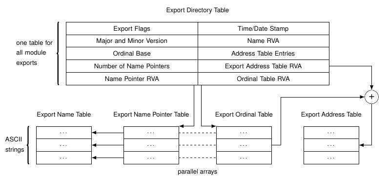
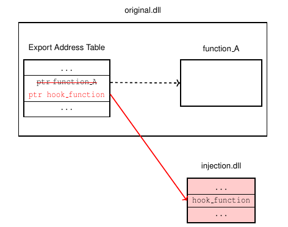
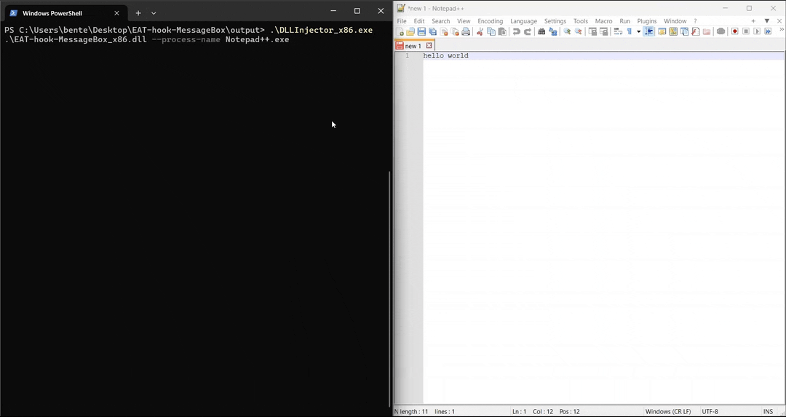

# Export Address Table (EAT) hook

This Visual Studio project contains an example of an EAT hook on the `MessageBoxW` function in the `user32.dll`.

## Background: DLL Linking

When a program is explicitly linked with a DLL and uses `GetProcAddress` to get access to a function in that DLL, the Export Address Table will be used.

If the program is implicitly linked to the DLL, the program will instead use its IAT to find the function.
In this case, it is possible to use an [IAT hook](https://github.com/BenteVE/IAT-hook-MessageBoxW) instead.

## EAT hook

To install an EAT hook, we will first inject the DLL in this project using a [DLL injector](https://github.com/BenteVE/DLL-Injector).
This DLL contains a hook function and an installation function.

The installation function will first traverse the Export Directory Table of the target DLL to find the location with the memory address of the target function.
The structure of the Export Directory Table is illustrated below.
The complete structure of the PE format is described in the [Microsoft PE format](https://learn.microsoft.com/en-us/windows/win32/debug/pe-format).



After the correct location has been found, it will overwrite the memory address of the real function with the address of the hook function in our injected DLL.



In this particular implementation, we will hook the `MessageBoxW` function in the `user32.dll`.
The hook function will simply call the original function with a modified argument to replace the title.

## Demo

1. Clone the repository:

    ```bash
    git clone https://github.com/BenteVE/EAT-hook-MessageBoxW.git
    ```

2. Build the DLL for the desired architecture (x86 or x64) using Visual Studio.
   The architecture of the DLL should match the architecture of the target program and the used DLL injector.

3. Use a DLL injector to inject the built DLL into the target process.
   The injector used here is available in another [repository](https://github.com/BenteVE/DLL-Injector) with a detailed explanation.

4. Verify the hook installation.
   After the hook is installed, the DLL automatically calls a test function that uses `GetProcAddress` to search the EAT and open a MessageBox.
   If the hook is installed correctly, `GetProcAddress` will find the address of the hook function and the title of the MessageBox will be changed.

    
